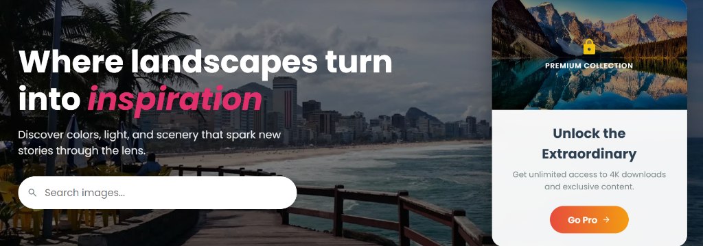

<div align="center">



# 🎨 InspirePixel

### _Where landscapes turn into inspiration_

[](https://vuejs.org/)
[](https://vitejs.dev/)
[](LICENSE)

**A premium visual inspiration platform** featuring stunning landscapes, exclusive content, and a seamless Pro experience.

[🚀 Live Demo](#) • [📖 Documentation](#features) • [💎 Go Pro](#pro-features)

</div>

---

## ✨ Features

### 🎯 Core Features

- **🖼️ Curated Gallery** - High-quality landscape photography
- **🔍 Smart Search** - Find inspiration instantly with debounced search
- **❤️ Favorites System** - Save and organize your favorite images
- **📱 Fully Responsive** - Seamless experience across all devices
- **🌙 Modern UI/UX** - Glassmorphism, gradients, and smooth animations

### 💎 Pro Features

- **🔓 Premium Content** - Access exclusive high-resolution images
- **⬇️ 4K Downloads** - Download images in full quality
- **🎨 Pro Gallery** - Exclusive collection from Unsplash API
- **✉️ Email Validation** - LGPD-compliant Pro activation
- **🏆 Pro Badge** - Visual distinction with premium branding

### 🔐 Authentication System

- **📧 Email Validation** - Secure user registration
- **🔒 Password Protection** - Minimum 6 characters
- **💾 Persistent Sessions** - Stay logged in across sessions
- **🎫 Pro Upgrade Flow** - Seamless transition to premium

### 📬 Newsletter Integration

- **✉️ Firebase Google Forms** - Automated email confirmations
- **✅ Email Validation** - Regex-based validation
- **💾 Fallback Storage** - LocalStorage backup
- **🎨 Premium Design** - Gradient form with animations

---

## 🛠️ Tech Stack

### Frontend

- **Vue 3** - Composition API with `<script setup>`
- **Vue Router** - SPA navigation with guards
- **Vite** - Lightning-fast build tool
- **SCSS** - Advanced styling with variables

### Libraries & APIs

- **@iconify/vue** - 200,000+ icons

- **Firebase** - Firebase integration for authentication and storage
- **Unsplash API** - High-quality image source (Pro)
- **Spotify Web API** - Music integration for an immersive experience

### Code Quality

- **Semantic HTML** - `<main>`, `<section>`, `<article>`, `<nav>`
- **Accessibility** - ARIA labels, roles, keyboard navigation
- **Clean Architecture** - Composables, reusable components
- **Modern Patterns** - Reactive state, computed properties

---

## 🚀 Quick Start

### Prerequisites

- Node.js 18+ and npm

### Installation

```bash
# Clone the repository
git clone https://github.com/bia024/ipx.git
cd inspirapixel

# Install dependencies
npm install

# Set up environment variables
cp .env.example .env
# Add your API credentials to .env

# Start development server
npm run dev
```

### Environment Variables

Create a `.env` file in the root directory:

```env
VITE_UNSPLASH_ACCESS_KEY=your_unsplash_key
VITE_SPOTIFY_CLIENT_ID=your_spotify_client_id
```

---

## 📂 Project Structure

```
inspirapixel/
├── src/
│   ├── assets/          # Images and static files
│   ├── components/      # Reusable Vue components
│   │   ├── Header.vue
│   │   ├── Hero.vue
│   │   ├── Gallery.vue
│   │   ├── Footer.vue
│   │   ├── AuthModal.vue
│   │   ├── ToastNotification.vue
│   │   └── BackToActions.vue
│   ├── composables/     # Vue composables
│   │   ├── useAuth.js
│   │   ├── useToast.js
│   │   └── useUnsplash.js (planned)
│   ├── views/           # Page components
│   │   ├── HomeView.vue
│   │   ├── ModeSelectionView.vue
│   │   ├── ContactView.vue
│   │   ├── InstitutionalView.vue
│   │   ├── PrivacyPolicyView.vue
│   │   ├── TermsView.vue
│   │   └── CopyrightView.vue
│   ├── router/          # Vue Router config
│   ├── App.vue          # Root component
│   └── main.js          # Entry point
├── public/              # Public assets
└── index.html           # HTML template
```

---

## 🎨 Key Components

### 🏠 Hero Section

- Split-screen layout with search and Pro showcase
- Debounced search with URL sync
- Animated premium card with call-to-action

### 🖼️ Gallery

- Lazy loading with Intersection Observer
- Premium content locking for Free users
- Favorites system with localStorage
- Responsive grid layout

### 🔐 Authentication Modal

- Tab-based UI (Login/Register)
- Real-time validation
- Toast notifications
- Smooth animations

### 📧 Newsletter Form

- Email validation
- Firebase integration
- Loading states
- Success/error feedback

---

## 💎 Pro Mode

### How It Works

1. **Select Pro** - Choose Pro plan on mode selection page
2. **Login Required** - Must be authenticated to upgrade
3. **Email Validation** - Email must match account (LGPD compliance)
4. **Confirmation** - Receive validation email
5. **Unlock Content** - Access premium features instantly

### Pro Benefits

| Feature           | Free       | Pro          |
| ----------------- | ---------- | ------------ |
| Gallery Access    | ✅ Limited | ✅ Full      |
| Image Quality     | Standard   | 4K           |
| Downloads         | ❌         | ✅ Unlimited |
| Exclusive Content | ❌         | ✅           |
| Pro Badge         | ❌         | ✅           |
| Priority Support  | ❌         | ✅           |

---

## 🎯 Roadmap

- [x] Core gallery functionality
- [x] Authentication system
- [x] Pro/Free mode distinction
- [x] Newsletter integration
- [x] Semantic HTML refactoring
- [ ] Unsplash API integration
- [ ] Image lightbox/modal
- [ ] Backend API
- [ ] Payment integration
- [ ] User dashboard
- [ ] Social sharing

---

## 🤝 Contributing

Contributions are welcome! Please follow these steps:

1. Fork the repository
2. Create a feature branch (`git checkout -b feature/AmazingFeature`)
3. Commit your changes (`git commit -m 'Add some AmazingFeature'`)
4. Push to the branch (`git push origin feature/AmazingFeature`)
5. Open a Pull Request

---

## 📄 License

This project is licensed under the MIT License - see the [LICENSE](LICENSE) file for details.

---

## 👩‍💻 Author

**Bianca Caetano - Software Engineer Student**

Passionate about crafting immersive digital experiences that inspire creativity and innovation using Vue.js, Vite, and modern web technologies.

- GitHub: [@bia024](https://github.com/bia024)
- Project: [InspirePixel](inspire-pixel-kcho.vercel.app/)

---

## 🙏 Acknowledgments

- Images from [Unsplash](https://unsplash.com)
- Icons from [Iconify](https://iconify.design)
- Email service by [Firebase](https://firebase.google.com/)
- Built with ❤️ using Vue 3 and Vite

---

<div align="center">

### ⭐ Star this repo if you find it helpful!

**Made with 💜 by Bianca Caetano**

[Back to Top ↑](#-inspirepixel)

</div>
